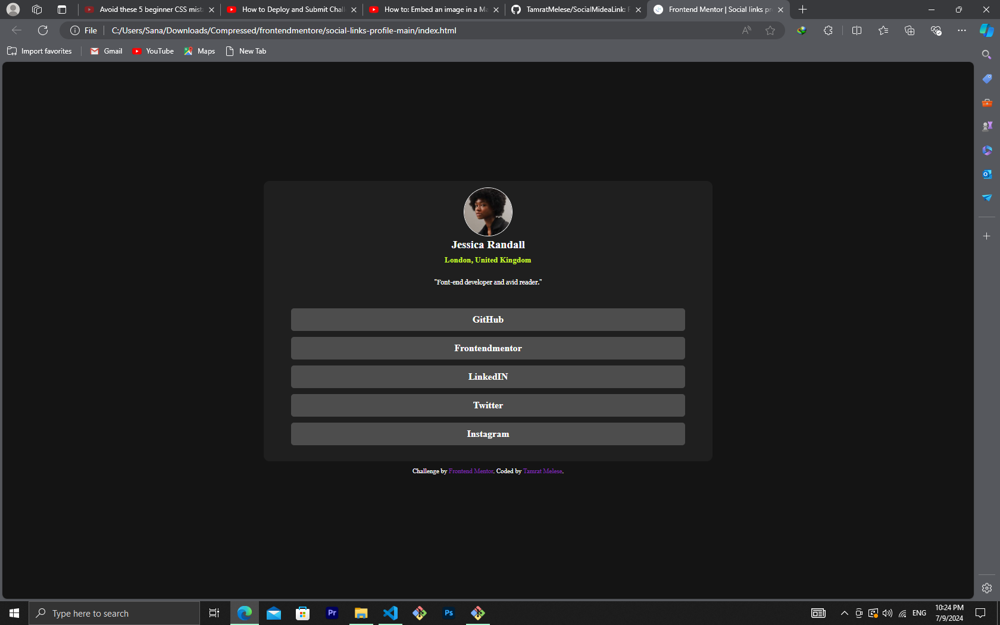

# Frontend Mentor - Social links profile solution

This is a solution to the [Social links profile challenge on Frontend Mentor](https://www.frontendmentor.io/challenges/social-links-profile-UG32l9m6dQ).

## Table of contents

- [Screenshot](#screenshot)
- [Links](#links)
- [Built with](#built-with)
- [What I learned](#what-i-learned)
- [Author](#author)
- [Acknowledgments](#acknowledgments)

### Screenshot



### Links

- Solution URL: [Add solution URL here](https://your-solution-url.com)
- Live Site URL: [Add live site URL here](https://your-live-site-url.com)

### Built with

- Semantic HTML5 markup
- CSS custom properties
- Flexbox
- CSS Grid

### What I learned

what i learned is that... how i can centered items and different display properties.
that justifycontent and align-items are only worked on a flex or grid headings..

```css
.container {
  display: flex;
  justify-content: center;
  align-items: center;
}
```

## Author

- Frontend Mentor - [@TamratMelese](https://www.frontendmentor.io/profile/TamratMelese)

## Acknowledgments

some youtubers like.. Kevin Powell
